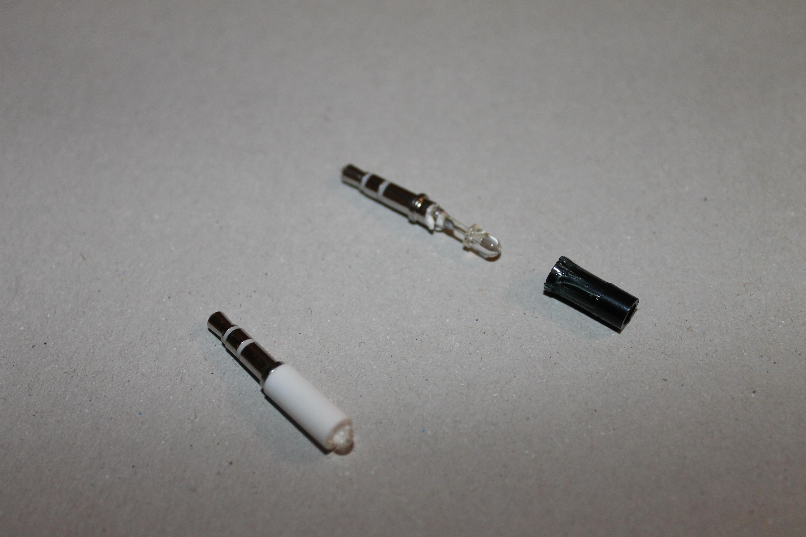

# SOIRAL

Receive or emit remote control codes through an adapter connected to the sound
card or serial port.

## Receive

The adapter is a single infrared photodiode connected to the microphone jack:
(http://ststefanov.eu/?p=142&lang=en "the infrared receiver page").
It may be soldered or assembled using breakouts.

The following programs use this adapter:

- **remote** decodes the signals received from a remote control

- **layout** stores all codes a remote control emits in a text file

- **signal2pbm** visualizes the raw infrared signals

## Send

Two adapters send remote control signals, one using the sound card and the
other the serial port. The first is the universal remote control for mobiles
that is sold for under a Euro on ebay; it is cheap and can be bought
ready-made, but it may work with the **irblast** program here or not, or only
at close range, depending on the sound card and the device to be controlled.
The serial port adapter needs to be made from parts, but is more reliable; it
can be assembled on a breadboard.

- **irblast** emits codes via the sound adapter

- **serial** emits codes via the serial adapter

